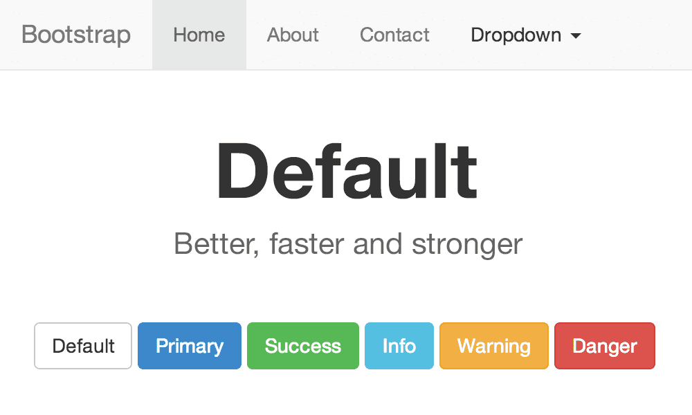
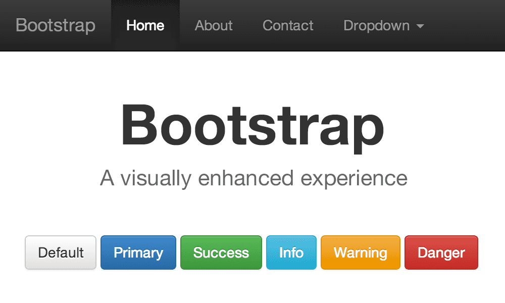
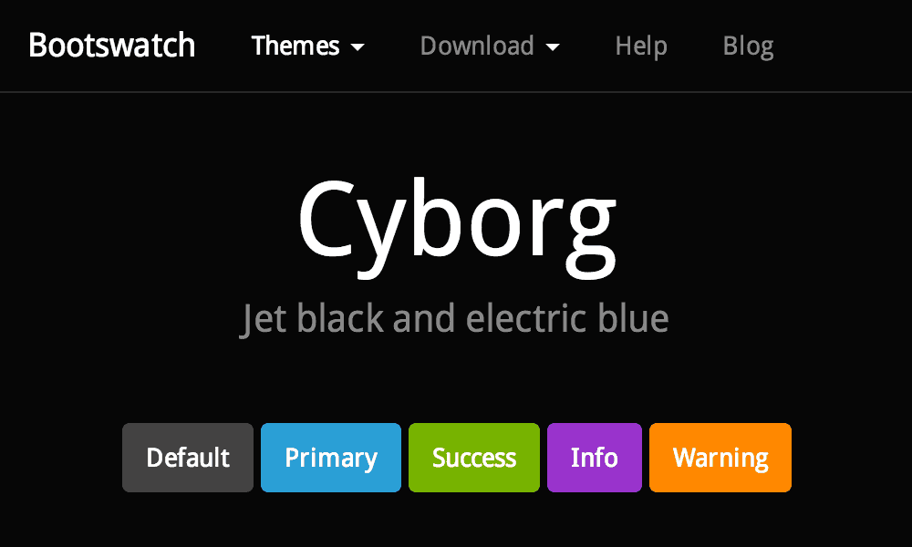
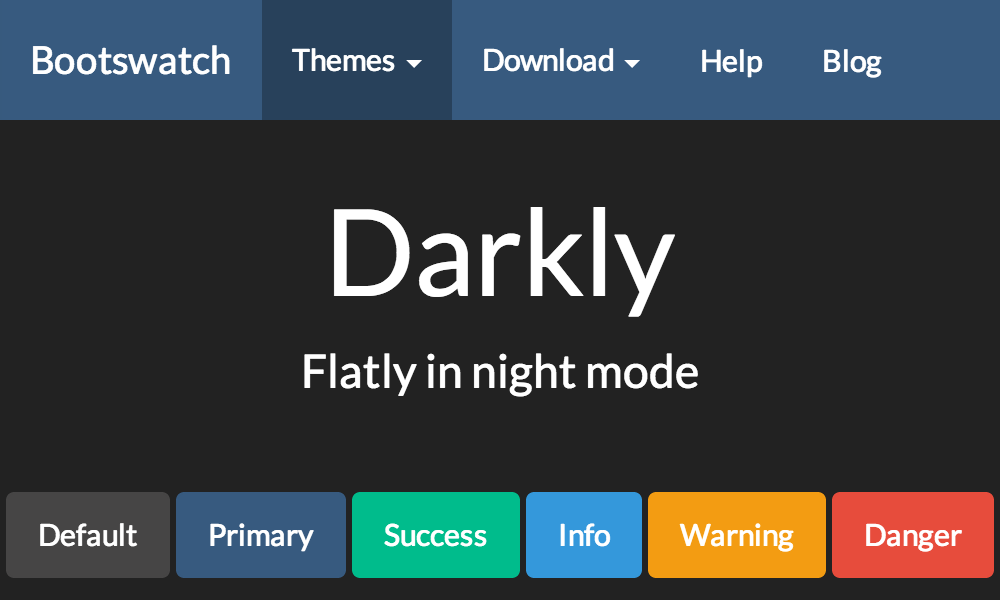
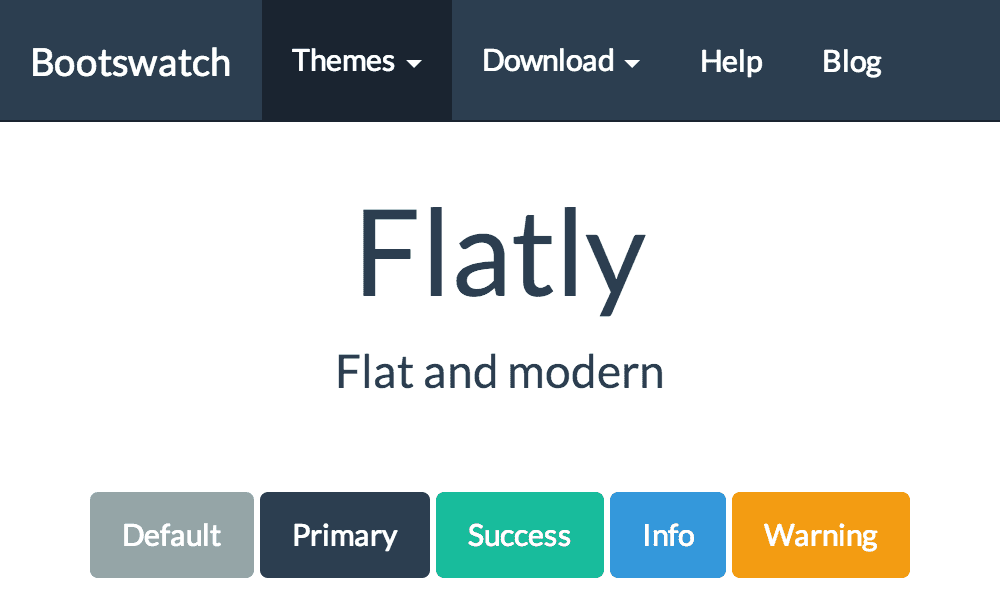
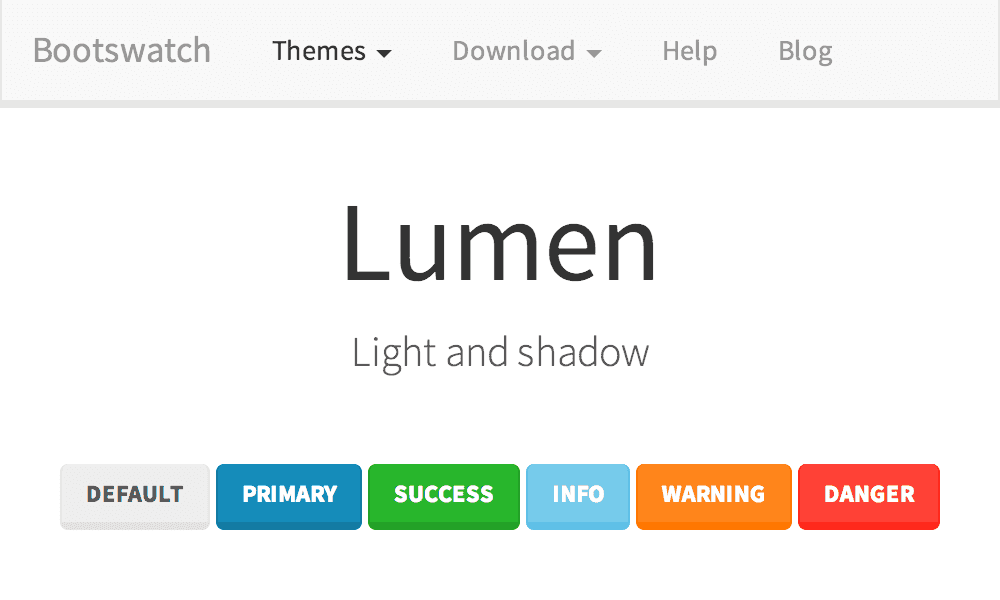
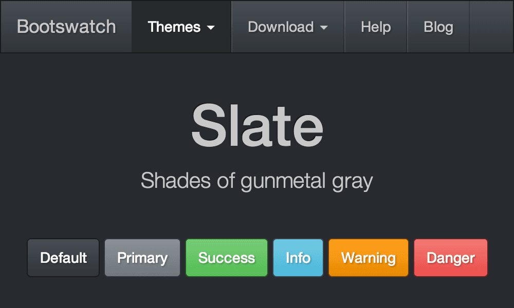
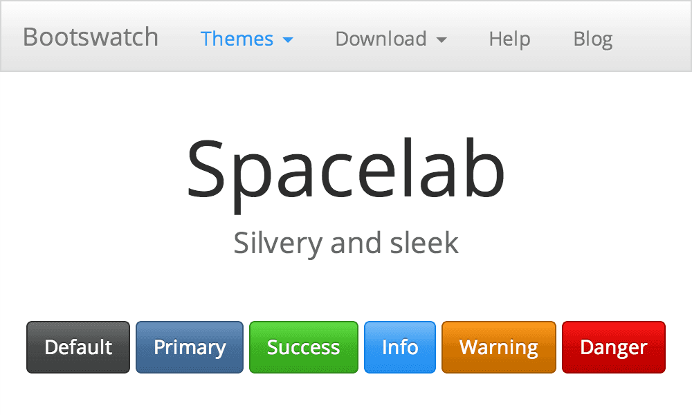
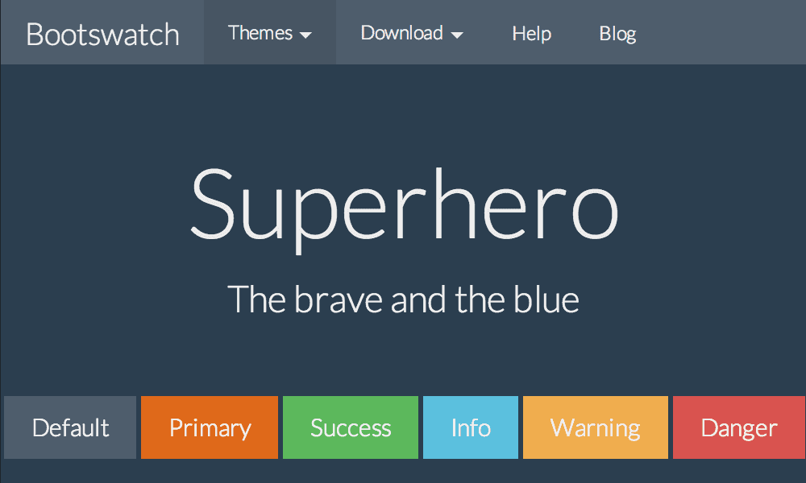

[](https://github.com/kasperisager/vanilla-bootstrap)

[](https://github.com/kasperisager/vanilla-bootstrap/releases) [](https://gemnasium.com/kasperisager/vanilla-bootstrap)

Bootstrap for Vanilla has been rewritten from scratch on top of [Bootstrap 3](http://getbootstrap.com) in this second installation of the most popular theme for Vanilla Forums. Kickstart your Vanilla-powered community forums with a fresh and solid theme that is ready to be customized to your heart's desires.

## Getting started

To get started using Bootstrap for Vanilla, either:

- [__Download the latest release__](https://github.com/kasperisager/vanilla-bootstrap/releases/latest)
- Clone the repository directly into your Vanilla `themes` directory:

```sh
$ git clone kasperisager/vanilla-bootstrap bootstrap
```

## Included themes

 |  |  | 
---|---|---|---
 |  |  | 
 |  |  | 
 |  |  | 

## Compiling assets

The following instructions assume that you have already installed Node.js on your computer. If this is not the case, please download and install the latest stable release from the official [Node.js download page](http://nodejs.org/download/). If you are using [Homebrew](http://brew.sh/), you can also install Node.js via the command line:

```sh
$ brew install node
```

> __Notice__: It is important that you install Node in a way that does not require you to `sudo`.

Once you have Node.js up and running, you will need to install the local dependencies using [npm](http://npmjs.org):

```sh
$ npm install
```

### Tasks

#### Build - `npm run build`
Compiles all theme assets using Gulp. LESS stylesheets will be compiled to [`design/style.css`](design/style.css) and Javascripts will be concatenated and output to [`js/custom.js`](js/custom.js).

#### Watch - `npm run watch`
Watches the assets for changes and runs the appropriate Gulp tasks. Also starts a Livereload server that will push the changes to your Vanilla installation automatically.

## [Issue tracking](https://github.com/kasperisager/vanilla-bootstrap/issues)

If you come across any bugs or if you have a feature request, please file an issue using the GitHub Issue tracker. Bootstrap for Vanilla won't be supported through http://vanillaforums.org so please stick to using GitHub for inquiries about bugs and feature requests. Thanks!

[__File a new issue or feature request__](https://github.com/kasperisager/vanilla-bootstrap/issues/new)

---

Copyright &copy; 2014 [Kasper Kronborg Isager](https://github.com/kasperisager). Licensed under the terms of the [MIT License](LICENSE.md)
